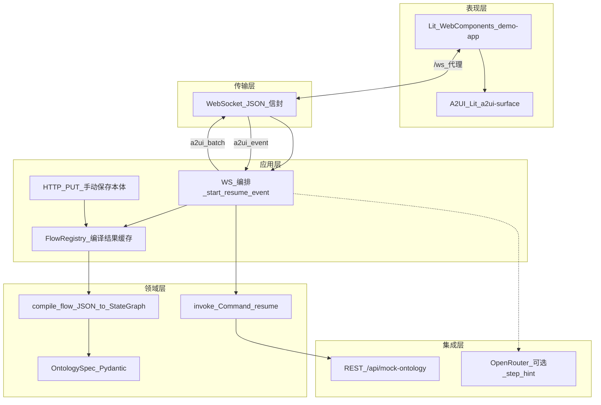
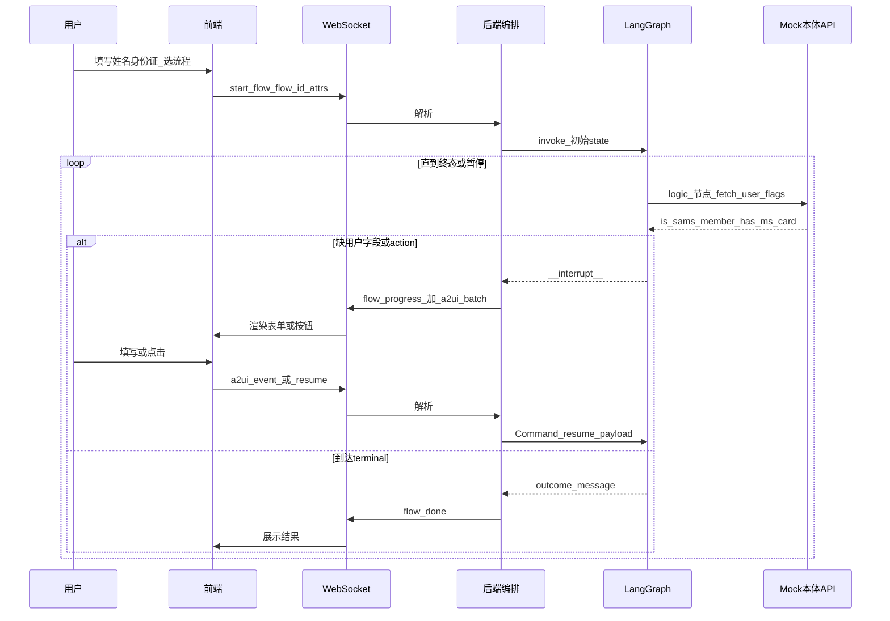
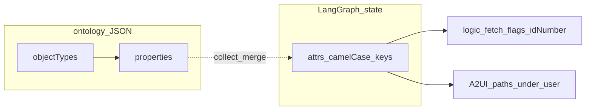
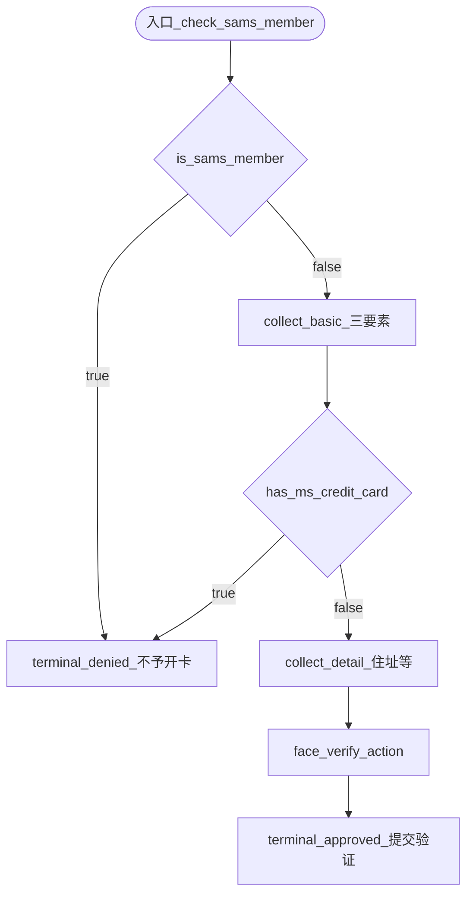
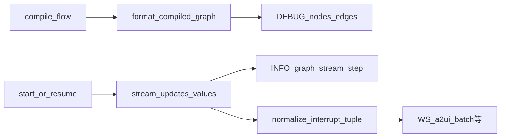
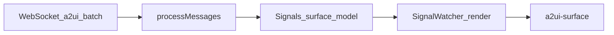
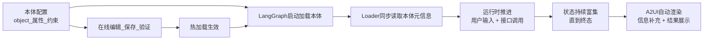
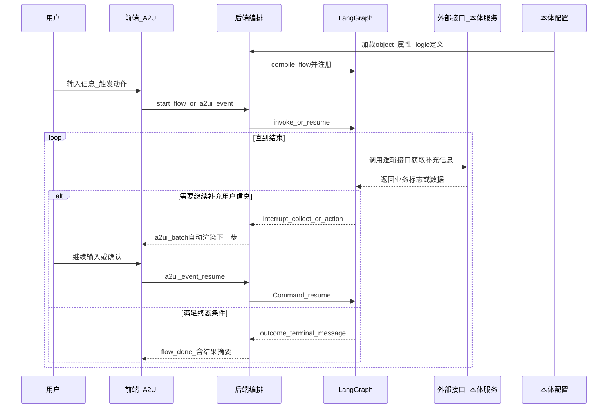

# a2ui-demo 设计文档（单一文档）

本文档为仓库内**唯一**设计说明：架构、Palantir Foundry 风格本体、A2UI 协议、OpenRouter、可观测性与验收。运行方式见 [README.md](../README.md)。

---

## 1. 设计目标与边界

| 目标 | 说明 |
|------|------|
| 可演示 | 信用卡开卡场景一条主路径 + 两条拒贷分支；第二种极简流程用于验证「按 flow_id 选逻辑」。 |
| 本体可配置 | 流程以 JSON 描述（非硬编码 Python），支持文件热加载。 |
| UI 协议标准 | 缺数/动作交互使用 [Google A2UI](https://github.com/google/A2UI) v0.8 消息，前端用 `@a2ui/lit` 渲染。 |
| 大模型可插拔 | 编排跳转由图与规则决定；OpenRouter 仅用于可选的「步骤提示」文案，避免 LLM 直接生成整段 A2UI 导致不稳定。 |

**不在本 demo 范围内**：生产级鉴权、真实人脸/征信接口、A2A 传输、多租户会话隔离。

---

## 2. 总体架构（图文并茂）

### 2.1 逻辑分层

### 2.2 端到端主流程（用户视角）

### 2.3 可观测性与日志

- **配置**：环境变量 `LOG_LEVEL`（默认 `INFO`），在 [`main.py`](../backend/src/a2ui_demo/main.py) 的 `lifespan` 入口调用 `logging.basicConfig(force=True)`。
- **链路**：WebSocket 收发包摘要 → [`runner.py`](../backend/src/a2ui_demo/flows/runner.py) 图 `invoke`/`Command(resume)` 前后 → [`ontology_client.py`](../backend/src/a2ui_demo/ontology_client.py) Mock 本体 HTTP →（可选）[`llm_form_schema.py`](../backend/src/a2ui_demo/llm_form_schema.py) / [`llm_user_input_union.py`](../backend/src/a2ui_demo/llm_user_input_union.py) 经 OpenRouter 生成表单 schema 或完整 A2UI messages 时的请求/耗时/metadata。
- **脱敏**：[`logging_utils.py`](../backend/src/a2ui_demo/logging_utils.py) 的 `sanitize_attrs_for_log` 对 `idNumber`、`phone` 等字段掩码后再写入日志；**绝不**打印 `OPENROUTER_API_KEY`。

#### 2.3.1 日志环节一览

| 环节 | 日志要点 |
|------|-----------|
| 应用启动 | `LOG_LEVEL`、`basicConfig` 格式 |
| WebSocket | `recv` 的 `type` / `flow_id`；`start_flow` 的脱敏 `attrs`；`a2ui_batch` 条数、`flow_done` 的 `outcome` |
| LangGraph | `thread_id`；编译后 `langgraph_edges_preview`、完整 `nodes`（INFO），`edges_full`（DEBUG）；执行时 `graph stream step=`、`graph final_state`（脱敏 `attrs`）；`invoke`/`resume` 结束与 `__interrupt__` 摘要 |
| Mock 本体 HTTP | 请求 URL、`flags`（不含完整证件号体） |
| OpenRouter | `model`、`base_url`、消息规模、耗时、`usage`（DEBUG） |

### 2.4 OpenRouter 配置

| 环境变量 | 说明 |
|----------|------|
| `OPENROUTER_API_KEY` | 密钥；未设置则不调用 LLM |
| `OPENROUTER_MODEL` | 默认 `openai/gpt-4o-mini` |
| `OPENROUTER_BASE_URL` | 默认 `https://openrouter.ai/api/v1` |
| `OPENROUTER_HTTP_REFERER` | 可选，写入请求头 `HTTP-Referer` |
| `OPENROUTER_APP_TITLE` | 可选，写入请求头 `X-Title` |
| `ENABLE_LLM_FORM_SCHEMA` | 默认开启；设为 `0`/`false` 可关闭 collect 节点的 LLM 表单 schema |
| `ENABLE_LLM_FULL_A2UI` | 默认开启；`user_input` 中断时允许 LLM 返回完整 v0.8 A2UI messages |

实现：[`config.py`](../backend/src/a2ui_demo/config.py)、[`llm_form_schema.py`](../backend/src/a2ui_demo/llm_form_schema.py)、[`llm_user_input_union.py`](../backend/src/a2ui_demo/llm_user_input_union.py)。示例变量见 [`.env.example`](../.env.example)。

---

## 3. 本体（Ontology / AIP Logic）设计

### 3.1 Palantir Foundry 风格对象建模

与 Foundry **Object Type + Property** 的公开语义对齐（便于与 OSDK / 控制台概念对照）：

| 概念 | JSON 位置 | 主要字段 |
|------|-----------|----------|
| 版本 | 顶层 | `ontologyVersion` |
| Logic 定义（可复用） | `logicDefinitions[]` | `apiName`, `displayName`, `description`, `implementation`（`type: mock_user_flags` + `flagKey`） |
| Action 定义 | `actionDefinitions[]` | `apiName`, `displayName`, `description`, `implementationKey` |
| Object Type | `objectTypes[]` | `apiName`, `displayName`, `description?` |
| Property | `objectTypes[].properties[]` | `apiName`, `type`, `displayName`, `required`, `fieldSource`（当前以 `user_input` 为主） |
| AIP Logic | `aip_logic` | `id`, `entry`, `inputs[]`（可选：`attributeApiName` / `required` / `description`） |
| Logic 节点 | `nodes[]` | `logicRef`（指向 `logicDefinitions`）、`edges` |
| Collect 节点 | `nodes[]` | `objectTypeApiName`, `propertyApiNames`, `next` |
| Action 节点 | `nodes[]` | `actionRef`（指向 `actionDefinitions`）、`next` |
| Terminal | `nodes[]` | `outcome`, `message` |

**运行时 `attrs`**：以各 Property 的 **`apiName`（camelCase）** 为键，例如 `fullName`、`idNumber`。逻辑节点拉取 Mock 标志时使用 `attrs["idNumber"]` 作为 URL 参数调用 `GET /api/mock-ontology/user/{idNumber}`；具体取哪个布尔字段由 `logicDefinitions[].implementation.flagKey` 决定。

**说明**：`fieldSource` 可为后续扩展预留；当前 **collect** 负责用户输入，**logic** 仅在 `logic` 节点内按需调 Mock，不在此做独立「属性解析器」。

**本体 JSON 与图状态的关系**：

### 3.2 山姆信用卡业务流（与产品流程图对应）

配置文件：[../ontology/sam_credit_card.json](../ontology/sam_credit_card.json)。

### 3.3 本体加载与手动更新

- **目录**：默认仓库根下 [`ontology/`](../ontology/)，可通过环境变量 `ONTOLOGY_DIR` 覆盖（见 [`config.py`](../backend/src/a2ui_demo/config.py)）。启动时加载 `*.json` 到 `FlowRegistry`。
- **手动更新**：不再使用文件监视器。通过 REST API：`POST /api/ontology/validate`（校验 JSON + 语义）、`GET /api/ontology/{flow_id}`（读取 `{flow_id}.json`）、`PUT /api/ontology/{flow_id}`（校验通过后落盘并重新 `compile_flow` + `register`）。前端「开始办理」页提供「校验 / 保存并应用」按钮。
- **失败回显**：校验失败时返回结构化 `errors[]`（`path` + `message`），不落盘。
- **会话策略**：已建立的 LangGraph `thread_id` 不迁移到新图；**新** `start_flow` 使用最新编译图。
- **`start_flow` 入参**：若 `aip_logic.inputs` 声明了必填属性，缺省则 WebSocket 返回 `type: error` 与 `errors`（不启动图）。

---

## 4. LangGraph 执行模型

### 4.1 状态（FlowState）

核心字段：`flow_id`、`attrs`（用户与流程累积字段）、`outcome` / `terminal_message`、`_branch`（logic 节点输出的 `"true"`/`"false"` 供条件边使用）。

定义见 [`state.py`](../backend/src/a2ui_demo/flows/state.py)。

### 4.2 节点类型与实现要点

| kind | 行为 |
|------|------|
| logic | 按 `logicRef` 查 `logicDefinitions`；`implementation.requestPathTemplate` 中 `{attrApiName}` 从 `attrs` 替换后 `GET`，再用 `flagKey` 读响应布尔值；写 `_branch`，`add_conditional_edges` 映射到下一节点。 |
| collect | 对节点 `propertyApiNames` 检查 `attrs` 是否仍缺；`interrupt` 里 **`property_api_names` 为该 objectType 在本体中的全部属性顺序**（用于展示已收集项），**`collect_field_names`** 与节点 `propertyApiNames` 一致（本步仍要采集的键），**`missing`** 为后者中仍空的字段。LLM 提示词与 schema 补全均以此区分「整对象展示」与「本步缺啥」。 |
| action | `interrupt({ kind: action, ... })`，恢复时认 `confirmed: true`。 |
| terminal | 写入 `outcome` / `terminal_message`，边连 `END`。 |

编译入口：[compiler.py](../backend/src/a2ui_demo/flows/compiler.py)。  
执行与中断解析：[runner.py](../backend/src/a2ui_demo/flows/runner.py)（`Command(resume=...)`）。

### 4.3 与「大模型驱动」的关系

- **驱动编排的是图**：分支不依赖 LLM 自由生成。
- **LLM 可选**：在 `collect` / `user_input` 等需要 UI 描述的路径上，若开启相应开关且配置了 `OPENROUTER_API_KEY`，则通过 OpenRouter 生成窄 schema 或（可选）完整 A2UI v0.8 messages；**分支与节点推进仍由 LangGraph 与本体编译结果决定**，LLM 不参与路由裁决。调用参数与耗时见服务端日志。

### 4.4 编译图与逐步执行可观测

**编译后 LangGraph 长什么样**：`compile_flow` 在 `StateGraph.compile()` 之后调用 `format_compiled_graph(graph)`（[`logging_utils.py`](../backend/src/a2ui_demo/logging_utils.py)），从 `graph.get_graph()` 读出 **节点列表**与**边**（`source` / `target` / `conditional`）。INFO 日志输出 `spec_nodes`、`langgraph_nodes`、`langgraph_edges` 计数、**`langgraph_edges_preview`**（`source->target` 逗号分隔，过长截断）、**完整 `nodes` 列表**；边的结构化列表仍在 DEBUG（`edges_full`）。

**执行到的状态**：`start_flow` / `resume_flow` 内用 `graph.stream(..., stream_mode=["updates", "values"])` 替代单次 `invoke`，与 `invoke` 的结束态一致（含将 stream 中 tuple 形式的 `__interrupt__` 规范为 list，供 `extract_interrupt_value` 使用）。对每个 **updates** 分片打 `graph stream step=` 日志：`node_id`（或 `__interrupt__`）、`current_node_id` / 脱敏 `attrs` / `outcome` 等摘要；`__interrupt__` 时另打 `log_interrupt_brief`。每次执行结束再打一条 **`graph final_state`**（INFO）：`current_node_id`、`outcome`、`interrupted`、脱敏后的 `attrs` 摘要。

---

## 5. A2UI 与前后端协议

### 5.1 服务端生成 A2UI

- 模板代码：[a2ui_templates.py](../backend/src/a2ui_demo/a2ui_templates.py)。
- 单步暂停下发消息序列：`surfaceUpdate` → `dataModelUpdate`（含 `/user/...` 预填）→ `beginRendering`，`surfaceId` 固定为 `main`（与前端一致）。

### 5.2 WebSocket 应用层信封（摘要）

**客户端 → 服务端**

| type | 用途 |
|------|------|
| `start_flow` | `flow_id` + 初始 `attrs` |
| `resume` | `thread_id` + `flow_id` + `payload`（与 `interrupt` 恢复约定一致） |
| `a2ui_event` | 将 Lit 触发的 `a2uiaction` 转为后端可消费的 `name` + `context` |

**服务端 → 客户端**

| type | 用途 |
|------|------|
| `flow_progress` | 当前节点（暂停时优先展示 interrupt 中的 `node_id`） |
| `a2ui_batch` | A2UI 消息数组 |
| `flow_done` | `outcome` + `message` + `attrs` + **`a2ui_messages`**（结束摘要，标签与字段顺序来自本体 `objectTypes`）+ `surface_id` |
| `error` | 错误说明 |

实现见 [`main.py`](../backend/src/a2ui_demo/main.py)。

### 5.3 前端事件回传

- Lit 组件派发全局事件 `a2uiaction`（见 `@a2ui/lit` 的 `StateEvent`）。
- [`demo-app.ts`](../frontend/src/demo-app.ts) 中：对 `submit_collect`，根据 `action.context` 里的 `path`，用 `A2uiMessageProcessor.getData` 从数据模型读出字段，组装为 `context` 字典，再以 `a2ui_event` 发往服务端。

### 5.4 前端 A2UI 挂载：`SignalWatcher` 与 `a2ui-surface`

`@a2ui/lit` 的 `A2uiMessageProcessor` / `a2ui-surface`（经 `Root`）基于 **`@lit-labs/signals` 的 `SignalWatcher(LitElement)`** 订阅数据模型变更。根页面若仅用普通 `LitElement`，在 `processMessages` 后仅自增本地 `@state` 计数，**可能无法稳定触发重绘**：`getSurfaces().get("main")` 返回的对象引用未变，而 `componentTree` 等已在 signal 侧就地更新。

**做法**：`DemoApp` 继承 **`SignalWatcher(LitElement)`**（与 `@a2ui/lit` 对齐的 `@lit-labs/signals` 版本），在 `render()` 中照常读取 `processor.getSurfaces().get("main")`，使模板在 signal 追踪下随模型更新。`a2ui-surface` 内的 `a2ui-root` 仅在 **`childComponents` 变化**时挂载渲染树的 `effect`；若首次挂载时 `componentTree` 尚未就绪，会卡在空视图。故每次 `a2ui_batch` 后使用 Lit **`keyed(this._tick, html\`...\`)`**，在 `_tick` 变化时销毁并重建 `a2ui-surface`，保证 `effect` 与当前 surface 一致。开发模式下可对 `a2ui_batch` 打 `console.debug`（surface keys、`hasMain`）。

依赖：前端 `package.json` 将 `@lit-labs/signals` 与 `@a2ui/lit` 声明为同级依赖，避免仅靠传递依赖解析。

### 5.5 对话式 UIUE（首表单 + 时间线 + 动态卡片）

当前前端采用三段式布局：

1. **固定首表单**：用户先填写姓名、身份证与流程 ID。
2. **对话时间线**：展示 `user/system/assistant` 三类消息（提交信息、节点推进、提示与结果）。
3. **当前交互卡片**：仅在存在 `a2ui_batch` 时渲染 A2UI 组件，用户完成后触发 `a2ui_event` 继续流程。

`a2ui_batch.messages_source` 用于标记卡片生成来源：

- `llm_intent_compiled`：`user_input` 中断由 LLM 先输出 `uiIntent`，后端再编译成 A2UI v0.8（主路径）。
- `llm_schema`：`user_input` 中断先经 LLM 输出结构化 schema，再转 A2UI。
- `template_fallback`：LLM 失败/未启用时回退模板。
- `template_on_intent_error`：`uiIntent` 解析/编译失败时回退模板。
- `template_non_user_input`：`action` 等非 `user_input` 中断直接模板。

推荐开关矩阵：

- `ENABLE_LLM_UI_INTENT=1`：开启 intent-first 主路径。
- `ENABLE_LLM_FORM_SCHEMA=1`：保留 schema 兼容路径。
- `ENABLE_LLM_FULL_A2UI=0`：默认关闭，作为实验路径按需开启。

---

## 6. Mock 本体规则（可测、可讲）

| 条件（身份证子串，大小写不敏感） | `is_sams_member` | `has_ms_credit_card` |
|----------------------------------|------------------|----------------------|
| 含 `SAMS_MEMBER` | true | 不变 |
| 含 `HAS_MS` | 不变 | true |
| 其他 | false | false |

实现：[mock_ontology_user](../backend/src/a2ui_demo/main.py) 路由（`main.py`）。

---

## 7. 关键文件索引

| 路径 | 职责 |
|------|------|
| [ontology/*.json](../ontology/) | AIP Logic 与节点定义 |
| [ontology_models.py](../backend/src/a2ui_demo/ontology_models.py) | Foundry 风格 ObjectType / Property 与流程节点 Pydantic 校验 |
| [config.py](../backend/src/a2ui_demo/config.py) | 环境配置（含 OpenRouter、日志级别） |
| [logging_utils.py](../backend/src/a2ui_demo/logging_utils.py) | 日志脱敏、截断、`format_compiled_graph` |
| [loader.py](../backend/src/a2ui_demo/flows/loader.py) | 加载 + 热加载 |
| [compiler.py](../backend/src/a2ui_demo/flows/compiler.py) | JSON → LangGraph |
| [a2ui_templates.py](../backend/src/a2ui_demo/a2ui_templates.py) | A2UI v0.8 消息模板 |
| [demo-app.ts](../frontend/src/demo-app.ts) | 页面 + WS + A2UI 挂载 |

---

## 8. 扩展建议（后续迭代）

1. **真实本体平台**：将 `OntologyPlatformClient` 的 base URL 与响应 schema 配置化；按 `properties[].fieldSource` 区分「只读平台字段」与「用户输入」。  
2. **更强 LLM 参与**：在受控 schema 下用结构化输出补全 `attrs` 抽取，仍对 A2UI 使用模板或校验后的 JSON。  
3. **观测与审计**：为每个 `thread_id` 记录节点迁移与 interrupt 次数，便于演示回放。

---

## 9. 修订记录

| 编号 | 说明 |
|------|------|
| **design-002** | 合并原 `DESIGN-002.md`：OpenRouter 可配置化（`BASE_URL` / Referer / Title）、全链路日志与脱敏、Foundry 风格 `objectTypes`/`properties` 与 camelCase `attrs`。本文档取代根目录分散的多份设计文件。 |
| **design-003** | LangGraph 编译图 / `stream` 逐步日志 / `graph final_state`；INFO 下 `langgraph_edges_preview` 与 `nodes`；前端 `SignalWatcher` + `keyed` 重建 `a2ui-surface`；`format_compiled_graph` 单测。 |
| **design-004** | 前端改为“固定首表单 + 对话时间线 + 动态A2UI卡片”；默认隐藏调试信息（仅开发态可展开）；补充 `messages_source` 语义。 |
| **design-005** | 新增“今日设计复盘”章节：主流程总览图、运行时时序图、五点结论落地与下一步建议。 |

---

## 10. 回归与验收

- 单元测试：`cd backend && uv run pytest`（含 `test_logging_utils`、`compiler`/`loader` 与 Foundry JSON）。
- 手工：后端 + 前端联调；`LOG_LEVEL=DEBUG` 可看到更细图与 LLM metadata（密钥仍不落日志）。

---

## 11. 今日设计复盘（design-005）

### 11.1 主流程总览（图文并茂）

本次设计形成了一个完整闭环：**本体定义流程语义，LangGraph 驱动执行推进，A2UI 承载交互与结果展示，本体配置可在线修改并热加载回流运行时**。

### 11.2 运行时时序（图文并茂）

### 11.3 五点结论落地

1. **本体设计已完成**：AIP logic 当前直接采用 LangGraph 结构承载，后续仅需增加「本体语义到图节点」转换层，不影响主流程推进模型。  
2. **加载链路清晰**：LangGraph 启动时加载本体，`loader` 同步获取 object/属性等元信息，保障配置语义与执行语义一致。  
3. **状态驱动推进**：用户输入与接口调用共同 enrich `attrs`，图按中断/恢复机制持续前进直至 terminal。  
4. **配置可运维**：本体文件支持在线编辑、保存、校验与热加载，支持不重启迭代流程定义。  
5. **UI 零改动渲染**：信息补充与结果页通过 A2UI 自动渲染，流程变更主要落在本体配置和后端编排，不依赖前端代码改动。  

### 11.4 下一步建议

- 增加「本体结构 → LangGraph」标准映射规范，降低后续多流程扩展成本。  
- 强化热加载一致性保护（版本号、失败回滚、会话切换策略说明）。  
- 补充端到端回归用例，覆盖 `start_flow -> interrupt/resume -> flow_done` 主链路与失败分支。
